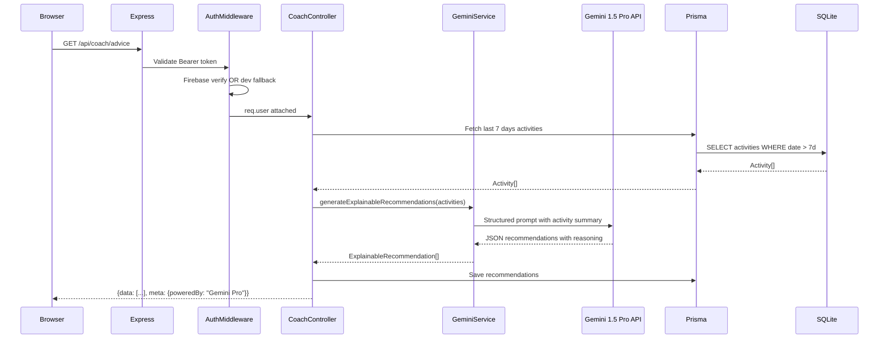
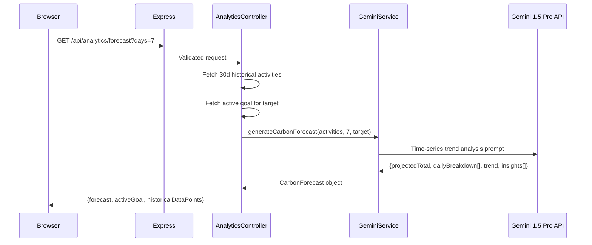
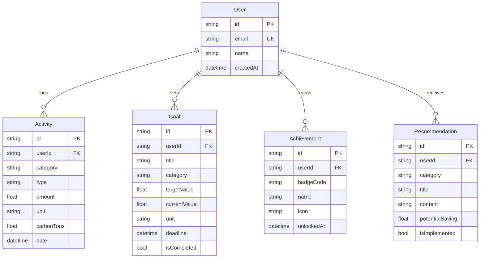
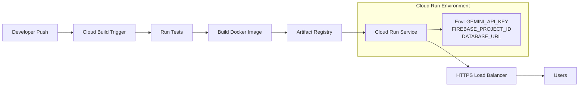

# EcoTrack AI — System Architecture

## Overview

EcoTrack AI is a full-stack carbon footprint awareness platform that integrates **Google Cloud services** to provide AI-driven sustainability coaching, real-time emission tracking, and forward-looking carbon forecasts. The architecture is designed for production deployment on Google Cloud Run with graceful local execution for development.

---

## High-Level Architecture

```mermaid
graph TB
    subgraph "Client Layer (React + Vite)"
        UI[React SPA]
        UC[AICoachView<br/>Explainable AI]
        UA[AnalyticsView<br/>Forecast Charts]
        UD[DashboardView<br/>Metrics]
    end

    subgraph "API Layer (Express + TypeScript)"
        AR[API Router<br/>/api/*]
        AM[Auth Middleware<br/>Firebase Admin]
        CC[Coach Controller]
        AC[Analytics Controller]
        GC[Activity/Goal Controllers]
    end

    subgraph "Service Layer"
        GS[GeminiService<br/>@google/generative-ai]
        DB[Prisma Client<br/>SQLite / PostgreSQL]
    end

    subgraph "Google Cloud Services"
        GEM[Gemini 1.5 Pro<br/>AI Recommendations + Forecasting]
        FB[Firebase Auth<br/>User Identity]
        CR[Cloud Run<br/>Container Hosting]
        GAR[Artifact Registry<br/>Docker Images]
    end

    UI --> AR
    AR --> AM
    AM --> FB
    AM --> CC
    AM --> AC
    AM --> GC
    CC --> GS
    AC --> GS
    GS --> GEM
    CC --> DB
    AC --> DB
    GC --> DB
    CR --> AR
    GAR --> CR

    style GEM fill:#4285f4,color:#fff
    style FB fill:#f57c00,color:#fff
    style CR fill:#34a853,color:#fff
    style GAR fill:#ea4335,color:#fff
```

---

## Data Flow: AI Coaching



---

## Data Flow: Carbon Forecasting



---

## Component Map

```
ecotrack-ai/
├── client/                        # React + Vite SPA
│   └── src/
│       ├── components/
│       │   ├── DashboardView.tsx  # Metric cards + activity feed
│       │   ├── TrackerView.tsx    # Activity logging form
│       │   ├── AnalyticsView.tsx  # Charts + Gemini forecast
│       │   ├── AICoachView.tsx    # Explainable AI recommendations
│       │   ├── GoalsView.tsx      # Goal management
│       │   ├── AchievementsView.tsx
│       │   └── EducationHubView.tsx
│       ├── services/
│       │   └── api.ts             # Typed REST client
│       └── types/
│           └── index.ts           # Shared TypeScript interfaces
│
├── server/                        # Express + Prisma API
│   └── src/
│       ├── controllers/
│       │   ├── activityController.ts
│       │   ├── coachController.ts  # Gemini-powered coaching
│       │   ├── analyticsController.ts  # Forecast endpoint
│       │   ├── goalController.ts
│       │   └── achievementController.ts
│       ├── services/
│       │   ├── geminiService.ts    # Gemini Pro integration
│       │   └── calculationService.ts
│       ├── middleware/
│       │   ├── auth.ts            # Firebase Admin auth
│       │   └── validation.ts
│       └── routes/
│           └── api.ts
│
├── competition/                   # Competition documentation
├── Dockerfile                     # Multi-stage Cloud Run image
├── docker-compose.yml             # Local development stack
└── cloudbuild.yaml                # Cloud Build CI/CD
```

---

## Database Design



---

## Deployment Architecture



---

## Security Architecture

| Layer | Control | Implementation |
|-------|---------|----------------|
| Transport | TLS 1.3 | Cloud Run managed HTTPS |
| Authentication | Firebase JWT | `auth.ts` middleware |
| API Security | Helmet.js headers | `app.ts` middleware |
| Input Validation | express-validator | All POST routes |
| CORS | Allowlist origins | `app.ts` configuration |
| Rate Limiting | Cloud Run concurrency | Deployment config |
| Secret Management | Secret Manager / env | `GEMINI_API_KEY` etc. |

---

## Graceful Fallback Strategy

| Service | With Config | Without Config |
|---------|-------------|----------------|
| Gemini AI | Real-time personalised coaching | Deterministic rule-based recommendations |
| Firebase Auth | Firebase JWT verification | Developer mock user (`dev-user-001`) |
| Cloud Run | Production container | `npm run dev` local server |

This design ensures the application is **100% runnable locally** without any GCP credentials, while demonstrating full production-grade Google Cloud integration.
